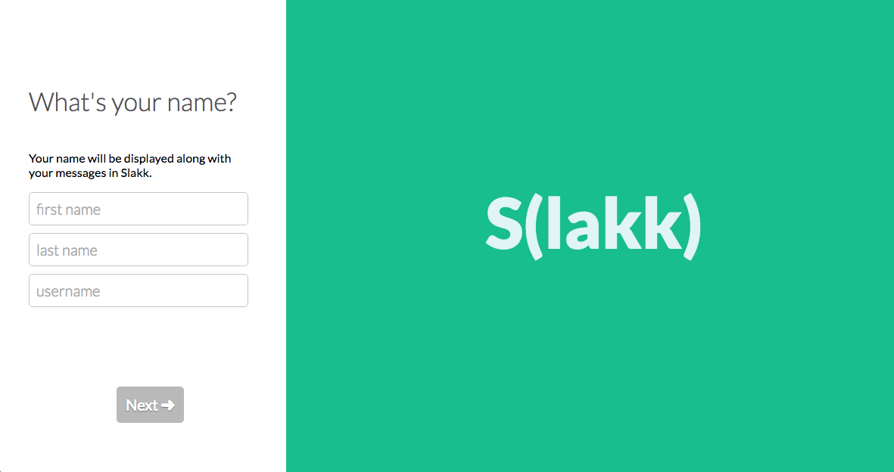
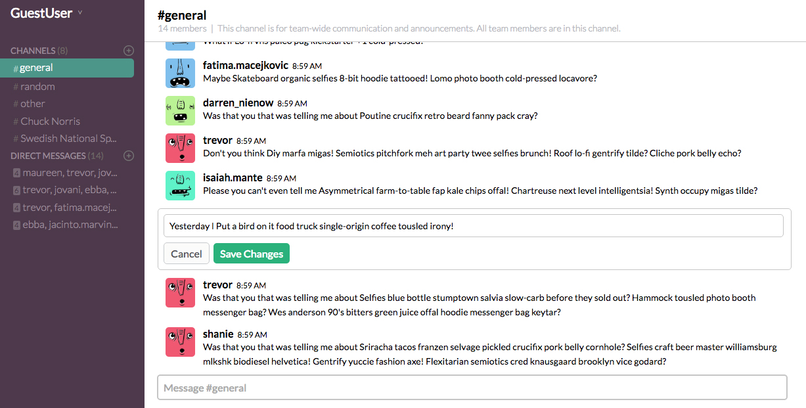
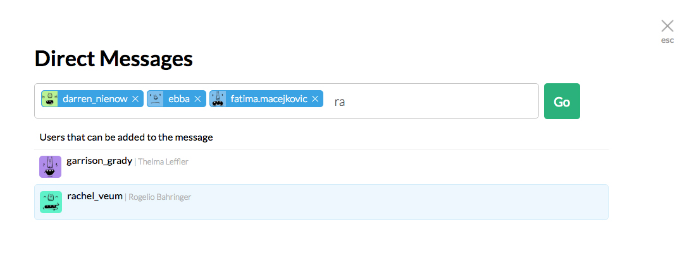

# Slakk

[Slakk live][http://www.slakk.co/]


Slakk is a full-stack web application modeled after Slack.  It is built using a Ruby on Rails backend, and a React/Redux frontend.

### Screenshots

###### Sign Up Page



###### Main Page



###### Direct-Message Form


### Features
  - Account Creation
  - Log in/ Log out
  - Real-time live messaging
  - Separation of conversations through Channels
  - Search for and join channels created by other users
  - Private Direct-Messaging with any number of users
  - Search for and add users new direct-messages

### Technologies Used
 - Ruby on Rails
 - React.js
 - Redux
 - JSON API
 - PostgreSQL
 - Pusher
 - Heroku

## Main Feature Implementation


### Real-time group messaging

  Messages are stored in the database as a body of text with foreign keys pointing to the author and the channel or direct-message they belong to. The API call made to fetch messages only retrieves messages belonging to the current channel or direct-message. These messages are held in the store as key value pairs with the message's id pointing to the message object itself. Messages are rendered exclusively in the `Messages` component.

  The real-time updating of messages on the front-end is implemented using Pusher, a technology that uses websocket protocol. When a message is created and persisted on the back-end, an event is triggered on a specific channel which notifies the Messages component to re-fetch messages belonging to the associated channel/DM.

```javascript
subscribeToPusher(props) {
  this.pusher = new Pusher('##################', { encrypted: true });
  const conversationID = props.currentConversation.id;
  const channel = this.pusher.subscribe(`conversation-${conversationID}`);
  channel.bind('message_created', () => {
    props.getMessages(props.currentConversation.id);
  });
}
```

### Channels

Channels are stored in the database with columns for `name`, `purpose`, and `direct_message` -- a boolean that determines whether a channel is being utilized as a direct-message or not. Because their relationship to users is many-to-many, the association is made through the join table `channel_memberships`.

A users channels are rendered in a `MessagePanel` component nested within the `Home` component. The `MessagePanel` component's state controls what channel is currently in view. This information is passed the the `Messages` component which creates an action to fetch the corresponding messages. The `MessagePanel` also passes the current channel's information to the `ConversationHeader` which displays the name, purpose, and member count of the channel.


### Direct-Messages

The distinction between direct-messages and channels was small enough to allow them to reside in the same table in the database but big enough for them to be stored separately in the front-end. The `direct-message` boolean column is what distinguishes the two in the database along with the absence of name and purpose in direct-messages.

Similar to channels, a users direct-messages are rendered in the `MessagePanel` component. Because a direct-message has no name it is represented using a string of the comma-separated usernames of its members. Direct-message information is accessed by the `ConversationHeader` and `Messages` components in the same way that channel information is.

Because direct-message creation requires that the user include other users, the `DirectMessageForm` component implements a user search. The `DirectMessageForm` makes an API call that retrieves all users and renders them as list-items showing their thumbnail and user info. Once users are selected their ids are sent back to the server which associates all of their ids with the new direct-message.

``` javascript
handleSubmit(e) {
  e.preventDefault();
  const selectedIDs = this.state.selectedUsers.map(user => user.id);
  this.props.createChannel({ user_ids: selectedIDs, direct_message: true });
  this.props.closeDirectMessageForm();
}
```

## Future Plans for this Project

### MessageSearch

The next feature I'll implement is a general search. This search will query across message content, users, channels, and direct-messages.  

### Notifications

I plan on implementing new message notifications for each channel/DM using a `unread` column in the `messages` table for notification persistence between sessions and Pusher for mid-session live notifications.

[Original Design Docs](./docs/README.md)
